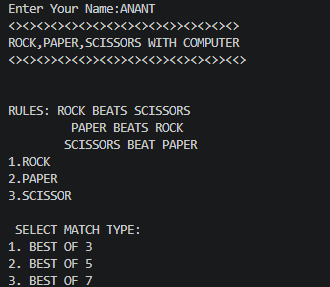
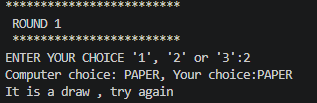
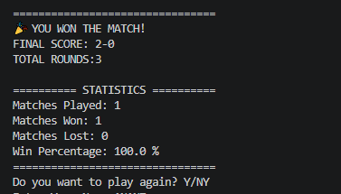

## Rock Paper Scissors Game

## 1. Project Overview

Rock Paper Scissors is a command-line based Python game where the player plays against the computer.

The computer randomly selects Rock, Paper, or Scissor, and the player's choice is compared with the computer's choice according to the game rules.

The project provides different match types such as Best of 3, Best of 5, and Best of 7. It also keeps track of the score and displays match statistics such as matches won, matches lost, and win percentage.

The project runs completely through the terminal and does not require a graphical user interface.

## 2. Features

* Player vs Computer gameplay
* Random computer choice
* Rock, Paper and Scissor choices
* Best of 3 match
* Best of 5 match
* Best of 7 match
* Round and score tracking
* Input validation
* Match result display
* Match statistics
* Matches won and lost tracking
* Win percentage calculation
* Play Again option

## 3. Technologies and Tools Used

* Python 3 - Main programming language
* Random module - Used to generate the computer's random choice
* Visual Studio Code - Used for writing and running the code
* Git - Used for version control
* GitHub - Used for storing and submitting the project repository

No external Python libraries are required.

## 4. Installation and Running the Project

### Step 1: Install Python

Make sure Python 3 is installed on your computer.

Check the installed version by opening a terminal and running:
python --version


If your system uses `python3`, run:
python3 --version
Python 3.x should be displayed.

### Step 2: Clone the Repository

Open a terminal and run:
git clone <YOUR-GITHUB-REPOSITORY-LINK>


Then enter the project folder:

```bash
cd Rock_Paper_Scissors
```

### Step 3: Install Dependencies

This project uses only Python's built-in `random` module.

Therefore, no external packages need to be installed.

There are no additional dependencies required to run the project.

### Step 4: Run the Project

Run the following command:
python main.py


If your system uses `python3`, run:
python3 main.py


The game will start directly in the terminal.

### Step 5: Play the Game

Select a match type:


1. BEST OF 3
2. BEST OF 5
3. BEST OF 7


Then select your choice:


1. ROCK
2. PAPER
3. SCISSOR


The computer will randomly select its choice and the result will be displayed.

### Game Rules

* Rock beats Scissor
* Paper beats Rock
* Scissor beats Paper
* Same choices result in a draw

The player who reaches the required winning score first wins the match.


## 5. Testing Instructions

The project can be tested directly through the command line.

### Step 1

Start the program:
python main.py


### Step 2

Test each match type:

* Best of 3
* Best of 5
* Best of 7

### Step 3

Test different player choices:

* Rock
* Paper
* Scissor

### Step 4

Check the following cases:

* Rock vs Rock → Draw
* Rock vs Paper → Computer wins
* Rock vs Scissor → Player wins
* Paper vs Rock → Player wins
* Paper vs Scissor → Computer wins
* Scissor vs Rock → Computer wins
* Scissor vs Paper → Player wins

### Step 5

Test invalid input and ask player to enter a valid choice.

### Step 6

Play more than one match and check whether:

* Match score is updated correctly
* Matches won are counted
* Matches lost are counted
* Win percentage is calculated correctly
* Play Again option works


## 6. Screenshots

### Screenshot 1 - Game Start



### Screenshot 2 - Gameplay



### Screenshot 3 - Final Result and Statistics



## 7. Author

Name: [ANANT KUMAR SINGH ]
Registration Number: [26BAI10584]
Institution: VIT Bhopal University
